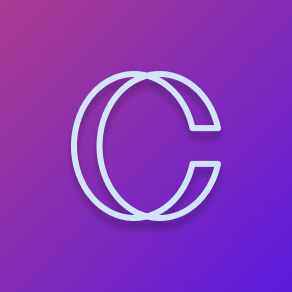

<!--CClone README.MD-->
<!--
*** I'm using markdown "reference style" links for readability.
*** Reference links are enclosed in brackets [ ] instead of parentheses ( ).
*** See the bottom of this document for the declaration of the reference variables
-->
[![Contributors][contributors-shield]][contributors-url]
[![Forks][forks-shield]][forks-url]
[![Stargazers][stars-shield]][stars-url]
[![LinkedIn][linkedin-shield]][linkedin-url]


<!-- PROJECT LOGO -->
<br />
<p align="center">
  <a href="https://github.com/ArmandPretorius/cclone">
    
  </a>

  <h3 align="center">CClone</h3>

  <p align="center">
    Find your celebrity clone.
    <br />
    <a href="https://github.com/ArmandPretorius/cclone"><strong>Explore the docs »</strong></a>
    <br />
    <br />
    <a href="https://youtu.be/-CkHLIKtVJ0">View Demo</a>
    ·
    <a href="https://github.com/ArmandPretorius/cclone/issues">Report Bug</a>
    ·
    <a href="https://github.com/ArmandPretorius/cclone/issues">Request Feature</a>
  </p>
</p>


<!-- TABLE OF CONTENTS -->
## Table of Contents

* [About the Project](#about-the-project)
  * [Built With](#built-with)
  * [Installation](#installation)
* [Features](#features)
  * [AI](#ai)
* [Usage](#usage)
* [Logic](#logic)
* [Contribution](#contribution)
* [License](#license)
* [Challenges](#challenges)
* [Contact](#contact)

<!-- ABOUT THE PROJECT -->
## About The Project


CClone is an Android application that uses Artificial Intelligence to find your celebrity look-alike. All you need to do is take a photo or select one from your camera roll.

This Project is for my Term 4 major subject, Interactive Development, for which we were tasked to conceptualise and create a simple application using machine learning, focused either on novelty or on accessibility. I decided to create a novelty app using <a href="https://www.clarifai.com/technology">Clarifai's Computer Vision</a> technology. The image that is selected gets compared to over 10 000 celebrities in Clarifai's trained <a href="https://www.clarifai.com/models/celebrity-image-recognition-model-e466caa0619f444ab97497640cefc4dc">Celebrity Model</a>.

The project also uses one of <a href="https://azure.microsoft.com/en-us/services/cognitive-services/">Microsoft Azure's Cognitive Services</a>, <a href="https://azure.microsoft.com/en-us/services/cognitive-services/bing-image-search-api/">Bing Image Search</a>, to find a picture of your celebrity clone.

### Built With
This Android application was build using:
* [Xamarin Forms](https://dotnet.microsoft.com/apps/xamarin/xamarin-forms)
* [C#](https://dotnet.microsoft.com/apps/xamarin/xamarin-forms)
* [Clarifai](https://www.clarifai.com/)

### Installation

1. DownloadVisual Studio 2019 [https://visualstudio.microsoft.com/vs/](https://visualstudio.microsoft.com/vs/) and Include Xamarin Forms in the installation process
2. Clone the repo
```sh
git clone https:://github.com/ArmandPretorius/cclone.git
```
3. Then open the project in Visual Studio

<!-- FEATURES -->
## Features

### AI


Take a photo or select one from your camera roll and find your celebritry clone!

### Share


Share with your friends who your celebrity clone is with a link to the app.

### Privacy Terms & Conditions


Have complete transparency with what your images will be used for by reading the Terms and Conditions

<!-- USAGE -->
## Usage

When opening CClone, you are presented with two options, to or take a photo or to pick a photo from your camera roll. This image will then be compared to over 10 000 celebrities.

Once the app has found your celebrity clone, the name of the celebrity and a picture of that celebrity will be returned with a beatiful animation.

You can then select an "Again?" button to take another picture.

There is also an information button in the top right corner that opens a Terms and Conditions modal, which explains Clarifai's <a href="https://www.clarifai.com/privacy">Privacy Policy</a> in regards of using your images.


To see a run through of the application, click below:

[View Demo](https://youtu.be/-CkHLIKtVJ0)
<!-- HOW DOES IT WORK -->
## Logic

* The application uses [Clarifai's Computer Vision Technology](https://www.clarifai.com/technology) to compare your image to more than 10 000 celebrities using their trained [Celebrity Model](https://www.clarifai.com/models/celebrity-image-recognition-model-e466caa0619f444ab97497640cefc4dc). Xamarin Forms has a NuGet package to help with this comparison.

*  project also uses one of [Microsoft Azure's Cognitive Services](https://azure.microsoft.com/en-us/services/cognitive-services/), [Bing Image Search](https://azure.microsoft.com/en-us/services/cognitive-services/bing-image-search-api/), to find a picture of your celebrity clone.


* The images are displayed using a NuGet Package called [FFImageLoading](https://github.com/luberda-molinet/FFImageLoading).

* The NuGet Package used to use the device's camera and access the camera roll, is called [MediaPlugin](https://github.com/jamesmontemagno/MediaPlugin).


<!-- Changes Made -->
## Changes

* I struggled with the animations. When the API requests are made, the animations break.

* I also would like to display more than one match (second and third match).

* I'd also like to finish it for iOS as well.


<!-- CONTRIBUTING -->
## Contributing

Contributions are what make the open source community such an amazing place to be learn, inspire, and create. Any contributions you make are **greatly appreciated**.

1. Fork the Project
2. Create your Feature Branch (`git checkout -b feature/YourAmazingFeature`)
3. Commit your Changes (`git commit -m 'Add some AmazingFeature'`)
4. Push to the Branch (`git push origin feature/YourAmazingFeature`)
5. Open a Pull Request


<!-- LICENSE -->
## License

Distributed under the MIT License. See `LICENSE` for more information.


<!-- CONTACT -->
## Contact

Armand Pretorius - [@amplified_designs](https://www.instagram.com/amplified_designs/) - 170045@virtualwindow.co.za


Project Link: [https://github.com/ArmandPretorius/cclone](https://github.com/ArmandPretorius/cclone)


<!-- MARKDOWN LINKS & IMAGES -->
[product-screenshot]: cclone_screenshot.png
<!-- MARKDOWN LINKS & IMAGES -->
<!-- https://www.markdownguide.org/basic-syntax/#reference-style-links -->
[contributors-shield]: https://img.shields.io/github/contributors/ArmandPretorius/cclone.svg?style=flat-square
[contributors-url]: https://github.com/ArmandPretorius/cclone/graphs/contributors
[forks-shield]: https://img.shields.io/github/forks/ArmandPretorius/cclone.svg?style=flat-square
[forks-url]: https://github.com/ArmandPretorius/cclone/network/members
[stars-shield]: https://img.shields.io/github/stars/ArmandPretorius/cclone.svg?style=flat-square
[stars-url]: https://github.com/ArmandPretorius/cclone/stargazers
[issues-shield]: https://img.shields.io/github/issues/ArmandPretorius/cclone.svg?style=flat-square
[issues-url]: https://github.com/ArmandPretorius/cclone/issues
[license-shield]: https://img.shields.io/github/license/ArmandPretorius/cclone.svg?style=flat-square
[license-url]: https://github.com/ArmandPretorius/cclone/master/LICENSE.txt
[linkedin-shield]: https://img.shields.io/badge/-LinkedIn-black.svg?style=flat-square&logo=linkedin&colorB=555
[linkedin-url]: https://www.linkedin.com/in/armand-pretorius-293b3a18a

